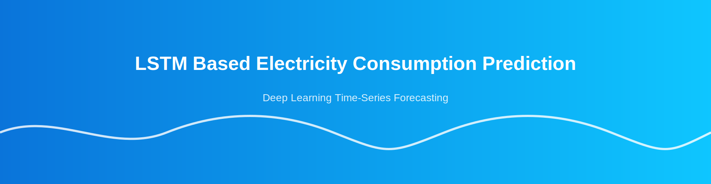
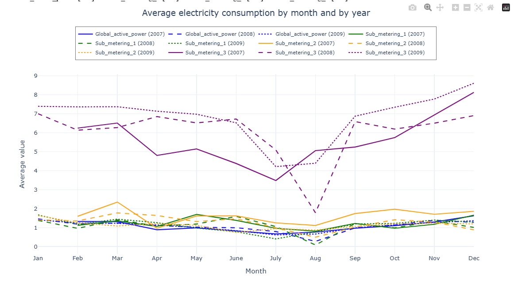
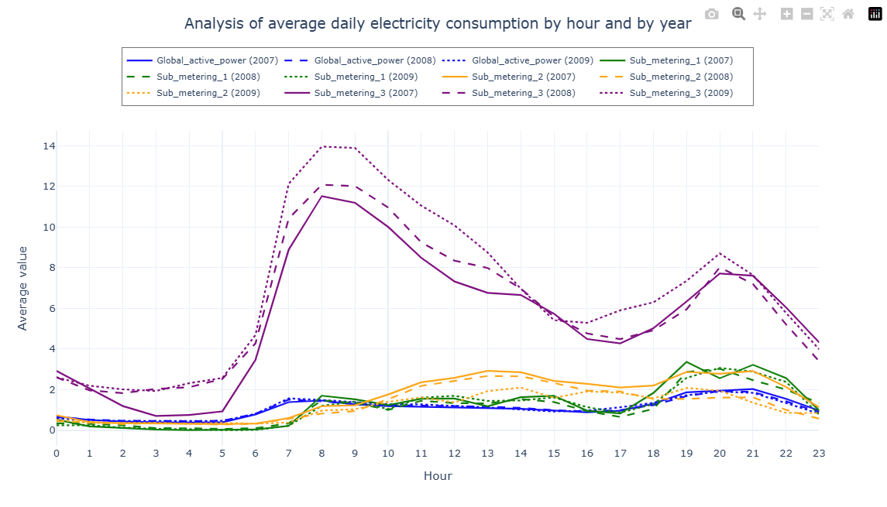
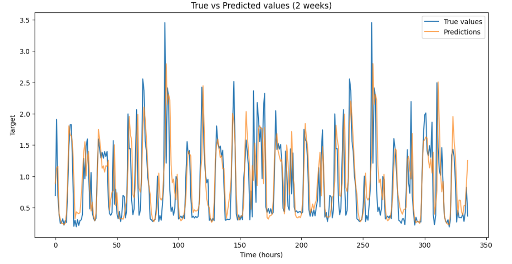
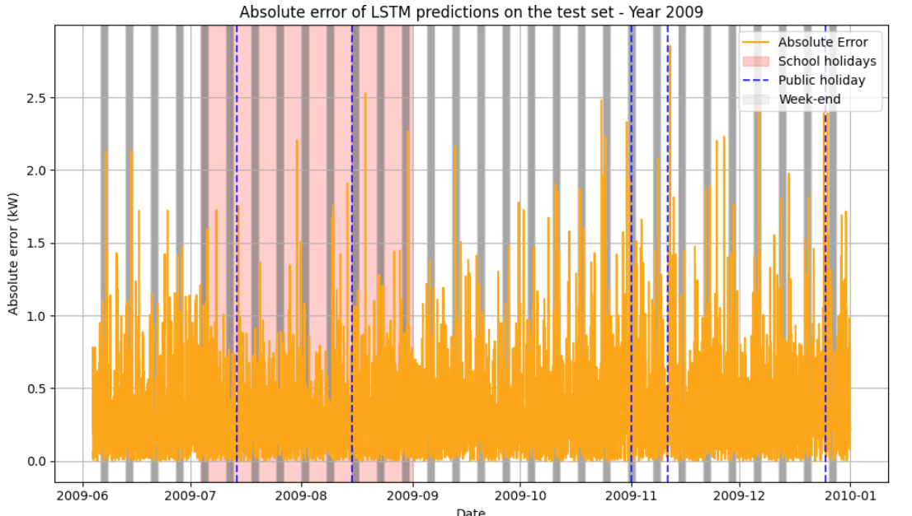

# LSTM Based Electricity Consumption Prediction
### A deep‑learning model that predicts future electricity consumption using LSTM‑based time‑series analysis.

  
  
  
  

  

  

## Table of Contents
- [About](#about)
- [Features](#features)
- [Installation](#installation)
- [Usage](#️usage)
- [Screenshots](#screenshots)
- [Roadmap](#roadmap)
- [Contributing](#contributing)
- [License](#license)
- [Support](#️support)

---

## About
LSTM-Based-Electricity-Consumption-Prediction is a machine learning project designed to forecast future household electricity usage using Long Short‑Term Memory (LSTM) neural networks. Electricity consumption naturally varies due to daily routines, weekends, weather changes, and holidays. Traditional forecasting methods struggle with these irregular patterns—this project uses deep learning to model them more accurately.
The goal is to provide a reliable system that predicts energy demand ahead of time, helping users better understand consumption behavior, optimize usage, and potentially reduce energy costs.

### Quick start / Dataset download  
A preprocessed CSV snapshot of the household_power_consumption dataset is available as a release asset.

- Latest release (CSV): https://github.com/FrancescoFran/LSTM-Based-Electricity-Consumption-Prediction/releases/latest
- Direct download (curl):
  curl -L -o household_power_consumption.csv "https://github.com/FrancescoFran/LSTM-Based-Electricity-Consumption-Prediction/releases/latest/download/household_power_consumption.csv"

---

## Features
- **Comprehensive Data Pipeline**  
  Automatic loading, cleaning, type conversion, datetime indexing, and exporting of processed datasets.

- **Advanced Exploratory Data Analysis**  
  Interactive visualizations, consumption‑pattern analysis, temporal trend inspection, and PACF‑based time‑series diagnostics.

- **Robust Preprocessing & Feature Engineering**
  Missing‑value imputation, outlier handling, hourly resampling, correlation analysis, VIF checks, and creation of temporal features (Hour, DayOfWeek, IsWeekend).

- **Deep Learning Forecasting Framework**
  Multiple LSTM architectures (stacked, dropout‑regularized, high‑capacity, long‑sequence models), TensorFlow dataset pipelines, evaluation metrics (MAE, RMSE, MAPE, SMAPE), prediction plots, error analysis, and model comparison.

---

## Installation
1. **Clone the repository**  
   git clone https://github.com/FrancescoFran/LSTM-Based-Electricity-Consumption-Prediction.git  
   cd project-name
   
3. **Install dependencies**  
   pip install -r requirements.txt

---

## Usage
  1. **Dataset:** Place CSV in `data/`.
  2. **Preprocess:**
     - Interactive: Open and "Run All" for: notebooks/preprocessing.ipynb
     - Headless (optional): jupyter nbconvert --to notebook --execute notebooks/preprocessing.ipynb --output notebooks/preprocessing_ran.ipynb
       ExecutePreprocessor.timeout=600
  4. **Train, Evaluate, Visualize results:**
     - Interactive: Open and "Run All" for: notebooks/lstm_training_evaluation.ipynb  
     - Headless (optional): jupyter nbconvert --to notebook --execute notebooks/lstm_training_evaluation.ipynb --output notebooks/lstm_training_ran.ipynb --
       ExecutePreprocessor.timeout=3600
     
---

## Screenshots

  <table style="width:100%; border-collapse:collapse;">
    <tr>
      <td style="width:50%; padding:0;">
        
      </td>
      <td style="width:50%; padding:0;">
        
      </td>
    </tr>
    <tr>
      <td style="width:50%; padding:0;">
        
      </td>
      <td style="width:50%; padding:0;">
        
      </td>
    </tr>
  </table>

---

## License
This project is under the **MIT License**.  
